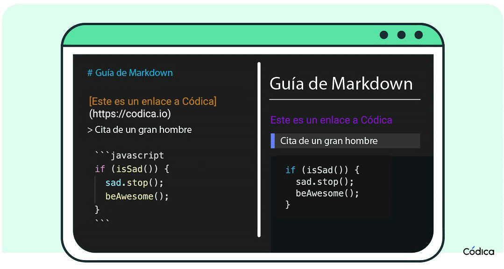

# Sprint 4

## **Sprint2**
La diferencia principal amb nfs es que l’autentificacio es a nivell d’usuari, no de host. Per a utilitzaar samba no cal tenir un NDAB pero si que existeix la possibiltiat d’integrar samba and LDAB

